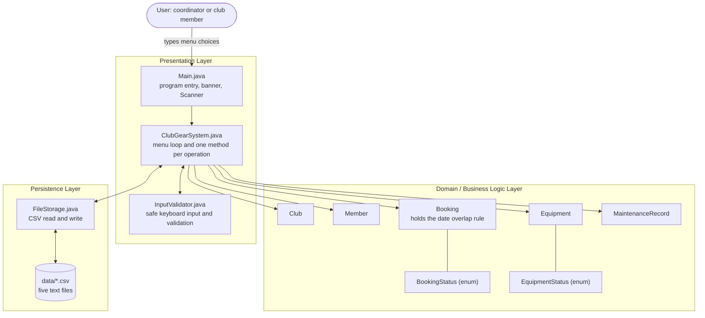
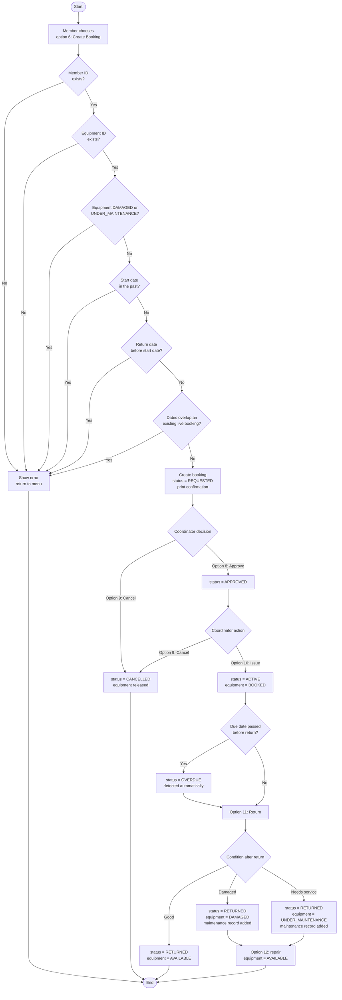
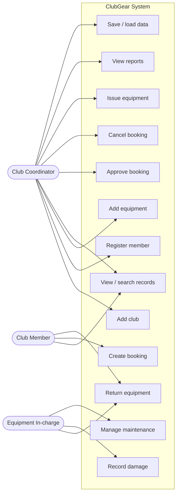
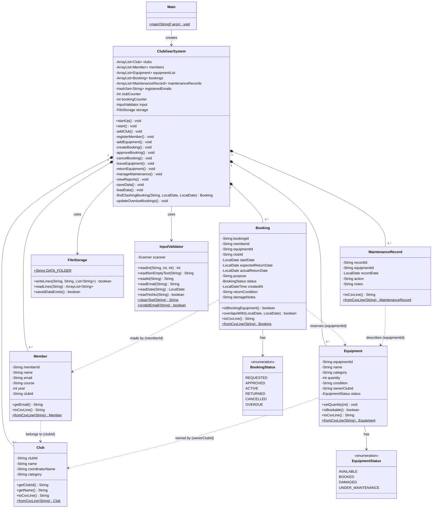
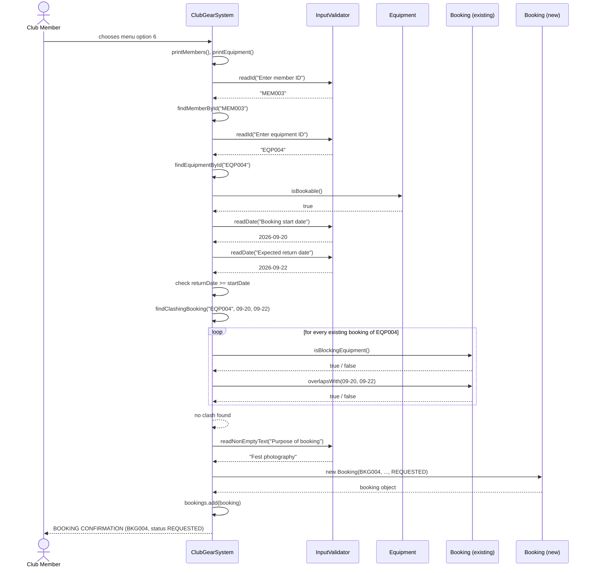
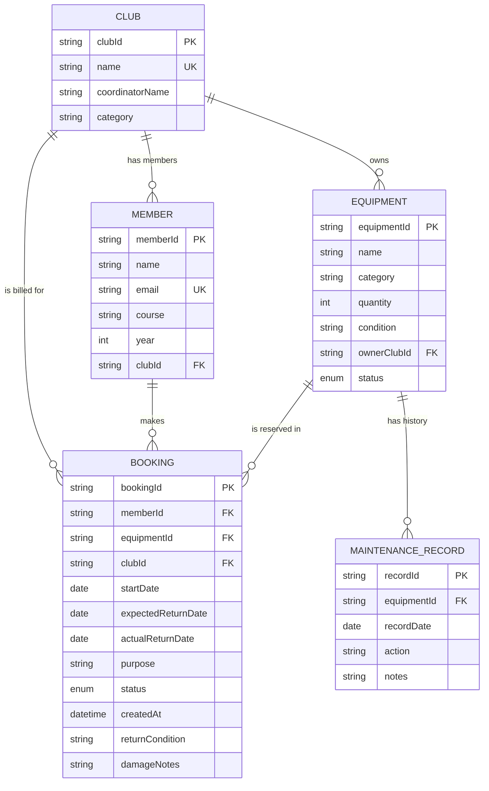

# ClubGear — Design Document

This document contains the architecture, workflow and UML design of the ClubGear system,
together with the storage design and the reasoning behind the main design decisions.

All diagrams are written in Mermaid, which GitHub renders automatically when this file is
viewed in the repository. The same diagrams are also available as SVG images in
`docs/diagrams/` (architecture, workflow, usecase, class, sequence, er) and are embedded in
`ClubGear_Project_Report.pdf`.

---

## 1. System Architecture

ClubGear follows a simple three-layer architecture. Each layer talks only to the layer
directly below it, which keeps the code easy to follow and easy to change.



**Why the layers are separated**

| Layer | Responsibility | Classes |
|-------|----------------|---------|
| Presentation | Show the menu, read input, print results and error messages | `Main`, `ClubGearSystem`, `InputValidator` |
| Domain | Hold the data and the rules that belong to the data itself | `Club`, `Member`, `Equipment`, `Booking`, `MaintenanceRecord`, the two enums |
| Persistence | Turn objects into text lines and text lines back into objects | `FileStorage`, plus the `toCsvLine()` / `fromCsvLine()` methods |

The domain classes never print anything and never read the keyboard, so they can be tested
directly by `tests/clubgear/ValidationTests.java` without any user interaction.

---

## 2. Process Flow / Workflow Diagram

This is the complete life cycle of one booking, which is the central workflow of the system.



---

## 3. Use Case Diagram



| Use case | Actor | Pre-condition | Post-condition |
|---|---|---|---|
| Create booking | Member | Member, equipment and club exist; equipment is not damaged | A booking with status REQUESTED exists |
| Approve booking | Coordinator | Booking status is REQUESTED | Booking status becomes APPROVED |
| Issue equipment | Coordinator | Booking status is APPROVED | Booking becomes ACTIVE, equipment becomes BOOKED |
| Return equipment | Member / In-charge | Booking is ACTIVE or OVERDUE | Booking becomes RETURNED, equipment released or flagged |
| Manage maintenance | In-charge | Equipment is DAMAGED or UNDER_MAINTENANCE | Equipment becomes AVAILABLE, history entry written |
| View reports | Coordinator | None | Statistics printed on the screen |

---

## 4. Class Diagram



**Note on the relationships.** `Member`, `Equipment`, `Booking` and `MaintenanceRecord` do
not hold object references to each other. They store the ID of the related record
(`clubId`, `equipmentId`, `memberId`) and the lookup happens through the helper methods
`findClubById()`, `findMemberById()` and `findEquipmentById()` inside `ClubGearSystem`.
This mirrors how foreign keys work in a database and makes CSV saving straightforward,
because each line stores only plain text.

---

## 5. Sequence Diagram — Creating a Booking

This is the most rule-heavy operation in the system, so it is the one worth showing in detail.



**The alternative flow** (what happens when a clash is found): `findClashingBooking()`
returns the clashing booking instead of `null`, the system prints
`Error: this equipment is already booked from ... (booking BKG004).`, no `Booking` object
is created, and control returns to the main menu.

---

## 6. Storage Design

ClubGear does not use a database. It stores five CSV text files inside a `data` folder.
The design is still relational in spirit: each file behaves like a table, the first column
is the primary key, and the ID columns act as foreign keys.

### 6.1 ER Diagram



### 6.2 File Schema

Every file begins with one header line starting with `#`, which the loader skips.
Values are separated by commas, and commas typed by the user are replaced with spaces by
`InputValidator.cleanText()` before the value is ever stored.

**data/clubs.csv**

| Column | Type | Rule |
|---|---|---|
| clubId | text | Primary key, format `CLB001` |
| name | text | Unique, not empty |
| coordinatorName | text | Not empty |
| category | text | Not empty |

**data/members.csv**

| Column | Type | Rule |
|---|---|---|
| memberId | text | Primary key, format `MEM001` |
| name | text | Not empty |
| email | text | Unique, must contain one `@` and a dot in the domain |
| course | text | Not empty |
| year | integer | 1 to 4 |
| clubId | text | Foreign key to clubs.csv |

**data/equipment.csv**

| Column | Type | Rule |
|---|---|---|
| equipmentId | text | Primary key, format `EQP001` |
| name | text | Not empty |
| category | text | Not empty |
| quantity | integer | Greater than zero |
| condition | text | Good / Average / Poor |
| ownerClubId | text | Foreign key to clubs.csv |
| status | enum | AVAILABLE / BOOKED / DAMAGED / UNDER_MAINTENANCE |

**data/bookings.csv**

| Column | Type | Rule |
|---|---|---|
| bookingId | text | Primary key, format `BKG001` |
| memberId | text | Foreign key to members.csv |
| equipmentId | text | Foreign key to equipment.csv |
| clubId | text | Foreign key to clubs.csv |
| startDate | date | ISO format `YYYY-MM-DD` |
| expectedReturnDate | date | Not earlier than startDate |
| actualReturnDate | date | `NONE` until the item is returned |
| purpose | text | Not empty, no commas |
| status | enum | REQUESTED / APPROVED / ACTIVE / RETURNED / CANCELLED / OVERDUE |
| createdAt | datetime | ISO `LocalDateTime` |
| returnCondition | text | `NONE` until returned |
| damageNotes | text | `NONE` when nothing is damaged |

**data/maintenance.csv**

| Column | Type | Rule |
|---|---|---|
| recordId | text | Primary key, format `MNT001` |
| equipmentId | text | Foreign key to equipment.csv |
| recordDate | date | ISO format |
| action | text | DAMAGE_REPORTED / SENT_FOR_MAINTENANCE / MAINTENANCE_COMPLETED |
| notes | text | Free text without commas |

### 6.3 Real saved data

This is the actual content of `data/bookings.csv` after the demo session:

```
# bookingId,memberId,equipmentId,clubId,startDate,expectedReturnDate,actualReturnDate,purpose,status,createdAt,returnCondition,damageNotes
BKG001,MEM001,EQP001,CLB001,2026-09-17,2026-09-19,NONE,Annual day photo coverage,APPROVED,2026-09-16T07:03:37.992917178,NONE,NONE
BKG002,MEM002,EQP002,CLB002,2026-09-10,2026-09-15,NONE,Tech talk audio setup,OVERDUE,2026-09-16T07:03:37.992948339,NONE,NONE
BKG003,MEM003,EQP003,CLB002,2026-08-27,2026-08-29,2026-08-29,Seminar presentation,RETURNED,2026-09-16T07:03:37.992995027,Good,NONE
BKG004,MEM003,EQP004,CLB001,2026-09-20,2026-09-22,2026-09-22,Fest photography,RETURNED,2026-09-16T07:03:38.101090557,Good,NONE
```

---

## 7. Design Decisions and Rationale

### 7.1 Why no inheritance or interfaces

An obvious temptation is a `Person` superclass for `Member`, or an `Entity` interface with
`toCsvLine()`. Both were rejected:

- `Club`, `Member`, `Equipment` and `Booking` share no behaviour, only the coincidence that
  each has an ID. Inheritance built on a coincidence produces a base class that has to be
  defended in a viva and cannot be.
- `fromCsvLine()` has to be **static** (it creates the object), and static methods cannot be
  declared in an interface as an instance contract, so an interface would only cover half the
  conversion and split the logic in two.

The decision is to use plain classes, and to be able to explain why.

### 7.2 Why an equipment record is one bookable asset

The alternative was a live stock count: quantity 4 means four simultaneous bookings.
That requires tracking how many units are out on every overlapping date range, which is a
genuinely harder algorithm than the syllabus needs. The chosen rule — one record, one
bookable asset, two cameras added as two records — keeps `findClashingBooking()` to eight
readable lines while still enforcing business rules 5 and 6 correctly.

### 7.3 Why the overlap test is written as a negation

```java
boolean noOverlap = otherEnd.isBefore(startDate) || otherStart.isAfter(expectedReturnDate);
return !noOverlap;
```

Testing for overlap directly needs four separate cases (inside, straddling the start,
straddling the end, surrounding). Testing for **non**-overlap needs only two, because two
ranges fail to touch only when one ends before the other begins. The negation is shorter and
far easier to prove correct — and `ValidationTests` checks all ten boundary cases, including
the day-exactly-touching ones.

### 7.4 Why OVERDUE is allowed to be returned

Business rule 9 says only active bookings can be returned. OVERDUE is not a different kind of
booking; it is an ACTIVE booking that is late. Refusing to accept a late return would leave
the equipment permanently locked, so `returnEquipment()` accepts both ACTIVE and OVERDUE and
prints a note that the item came back late.

### 7.5 Why commas are stripped from user input

The files use commas as separators, so a club named `Photography, Film & Media` would break
the line into five columns instead of four and silently corrupt the file on the next load.
Rather than writing a quoting and escaping parser (which is real work and not the point of
the exercise), `InputValidator.cleanText()` replaces commas with spaces at the moment of
entry. The limitation is documented rather than hidden.

### 7.6 Why every input goes through `readLine()`

Mixing `nextInt()` and `nextLine()` on one `Scanner` is the classic Java beginner bug: the
newline left behind by `nextInt()` is swallowed by the next `nextLine()`, which then returns
an empty string. `InputValidator` reads **every** input as a full line and parses it
afterwards, so the bug cannot occur anywhere in the program.

### 7.7 Why status changes are checked before they are applied

Each of `approveBooking()`, `cancelBooking()`, `issueEquipment()` and `returnEquipment()`
begins by testing the current status and refusing with a message naming the actual state
(`Error: booking BKG005 is CANCELLED. Only APPROVED bookings can be issued.`). This makes the
state machine in section 2 enforceable in one place per transition instead of being implied
across the code.
